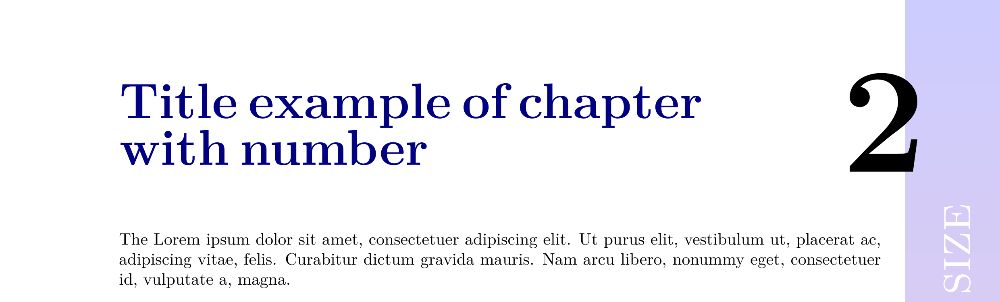

# chapter-format-rightbar-text package

Modifiy de chapter format

## Install package
Put the `chapter-format-rightbar-text.sty` file in any of these locations

* Put the `chapter-format-rightbar-text.sty` file in the same path of main tex file, or.
* Execute the commmand:

		kpsewhich -var-value=TEXMFHOME

    and this returns the path of local tex files. By example, if returns 

		/home/username/texmf

    then, put the `chapter-format-rightbar-text.sty` file in the directory.

		/home/username/texmf/tex/latex/chapter-format-rightbar-text/chapter-format-rightbar-text.sty

## Load the package

To load the package use the next command in the preamble of main tex document.

	\usepackage{chapter-format-rightbar-text}

The command `usepackage` find the `chapter-format-rightbar-text.sty` file in the directories listed in the last section.
By other side, if we locate the `chapter-format-rightbar-text.sty` file in `/some/path`, 
the we can load the package using the next command.

	\usepackage{/some/path/chapter-format-rightbar-text}

